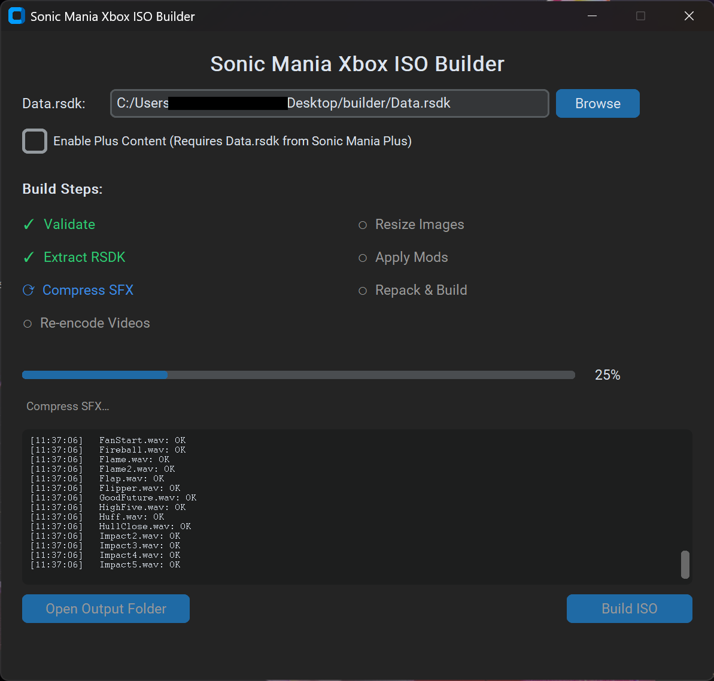

# Sonic Mania Xbox ISO Builder

This is a standalone GUI tool for building Sonic Mania for the original Xbox. Output includes both a burnable disc image and a HDD-ready game folder. A modded Xbox is still required to play a burned disc!



## What does this do/why is it needed?

We have a tight 64MB RAM budget on a stock Xbox, so we need to compress certain assets to fit. Namely, SFX are downsampled from 44.1kHz to 22kHz, which gives us much more wiggle room without sacrificing much in terms of audio quality. Music is left uncompressed, as I felt the drop in quality there was more noticeable and didn't alleviate nearly as much RAM pressure compared to SFX.

All FMVs are also re-encoded to 640×360 so the Xbox doesn't have a problem playing them full-speed. Higher resolutions are more challenging. This also means scaling is trivial, as we can letterbox 360p videos in a 480p frame and scale it by an even 2x for 720p. We also perform a similar resize process for the few static images in the game.

And then lastly, the tool packs in any mods present in 'assets/Mods'. I've got sprite replacements for Xbox controller UI elements in there, and that's it. You can technically pack in your own mods here too, although no gaurantees anything will work beyond simple asset replacements. There is barely any RAM overhead left to accomodate additive mods.

## Usage

To build, you will just need to supply your game's **Data.rsdk** to the tool. You should use the Data.rsdk file from the last official update for the Steam version of the game - any older versions may not work. For the Steam copy, you can find its Data.rsdk alongside the game's executable in its Steam directory.

* Extract the '**Sonic Mania Xbox Builder**' folder from the release package wherever you like. Your folder structure should look like this (make sure the other folders are present alongside the tool!):
```
Sonic Mania Xbox Builder/
├── _internal/
├── assets/
├── licenses/
└── Sonic Mania Xbox Builder.exe
```

* Launch the tool by running '**Sonic Mania Xbox Builder.exe**'.
* Click '**Browse**' at the top to point the tool to your unmodified Data.rsdk file.
* If you have the Encore DLC, also check the '**Enable Plus Content**' checkbox so you can use it in-game.
* Click '**Build ISO**'. It might take a few minutes to unpack, compress, and repack everything.
* Done! Click '**Open Output Folder**' to navigate to your build directory. This will take you to the new '**Output**' folder alongside the tool. You'll find **SonicMania.iso** for burning to a DVD, along with an HDD-Ready game folder you can just FTP to your system's drive like any other game.

## Output

```
Output/
├── SonicMania.iso              ← For burning to a DVD
└── Sonic Mania (HDD-Ready)/    ← For playing from your HDD/SSD
    ├── default.xbe
    ├── Data.rsdk
    ├── Settings.ini
    ├── TitleMeta.xbx
    ├── TitleImage.xbx
    └── SaveImage.xbx
```

## What the Xbox version can do
* FMV playback
* Nearly fullspeed UFO + pinball stages
* 480p and 720p(!) support
* Time attack score saving
* Mod loading technically works, but anything beyond simple asset replacements are not recommended

## What the Xbox version *can't* do
* Multiplayer splitscreen (not enough RAM headroom for additional frame buffers)
* Replays (not enough RAM headroom for a replay buffer)

## Compromises to make this work
* Decorations and shadows are disabled on UFO stages for performance
* Downsampled SFX
* Compressed FMVs
* There is some additional loading times in-between stage transitions compared to other platforms, but nothing too egregious

## Requirements if you want to build the utility yourself

- Python 3.10+
- `customtkinter` and `pyinstaller` (see `requirements.txt`)
- `ffmpeg` and `extract-xiso` are downloaded automatically on first use — see [External tools](#external-tools) below

```bash
pip install -r requirements.txt
```

## Running from source

```bash
python -m builder
```

## Assets folder setup

The `assets/` directory must contain:

| Path | Description |
|---|---|
| `assets/default.xbe` | Xbox executable |
| `assets/xbx/TitleMeta.xbx` | Xbox dashboard title metadata |
| `assets/xbx/TitleImage.xbx` | Xbox dashboard title thumbnail |
| `assets/xbx/SaveImage.xbx` | Xbox dashboard save thumbnail |
| `assets/Settings.ini` | Default settings |
| `assets/Mods/` | Optional mod files |

The `assets/Mods/` directory mirrors the game's `Data/` layout. Any files placed here will override the equivalent files extracted from `Data.rsdk`.

## External tools

Both external tools (ffmpeg and extract-xiso) are downloaded at runtime if not already present:

| Tool | Source | Version |
|---|---|---|
| ffmpeg | [ffbinaries](https://ffbinaries.com) | `6.1` |
| extract-xiso | [XboxDev/extract-xiso](https://github.com/XboxDev/extract-xiso) releases | `build-202505152050` |

| Platform | Cache root |
|---|---|
| Windows | `%LOCALAPPDATA%\SonicManiaXboxBuilder\` |
| macOS | `~/Library/Application Support/SonicManiaXboxBuilder/` |
| Linux | `~/.local/share/SonicManiaXboxBuilder/` |

## Building the utility

```bash
python build_dist.py
```

Windows/Linux Output:
```
dist/Sonic Mania Xbox Builder/
├── Sonic Mania Xbox Builder[.exe]
├── assets/
└── licenses/
```

macOS Output:
```
dist/
├── Sonic Mania Xbox Builder.app
├── assets/
└── licenses/
```

## License & credits

- Original RSDK (Retro Engine) authors: **Evening Star**
- RSDKv5 decompilation authors: **Rubberduckycooly and chuliRMG**

Neither the engine nor the decompilation is the work of this project.

**Not for commercial use.** No game assets are distributed — you supply a `Data.rsdk` from
your own legitimate copy of Sonic Mania. The Plus DLC ships disabled and is enabled only by a deliberate choice in the builder.

Third-party tools downloaded at runtime are covered separately; see
[`licenses/README.md`](licenses/README.md).
